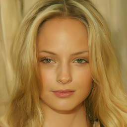
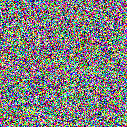
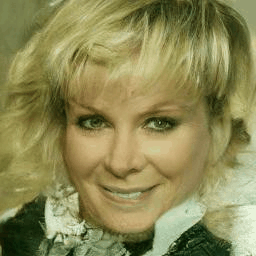

# Diffusion Visualisation Project

This project was developed as part of the seminar *Understanding Deep Learning* during the summer semester of 2025 at Osnabrück University.

## Overview

Our project explores and illustrates the **diffusion process** and its **reverse (denoising) process** in diffusion models. 

We provide:
- **Intuitive visualizations** of both the forward (noising) and backward (denoising) processes.
- **Animations and experiments** to better understand how noise affects image generation.
- **An experiment with similar noise**, showing how slight variations in the starting noise (just a single batch in the image) can produce different outputs.

---

## Quickstart

To run the project locally, follow these steps:

### 1. Clone the repository

```bash
git clone https://github.com/Noxmain/Diffusion
cd Diffusion
```

### 2. Set up a virtual environment

```bash
python3 -m venv venv
source venv/bin/activate       # On Windows: venv\Scripts\activate.bat
```

### 3. Install dependencies

```bash
pip install -r requirements.txt
```

### 4. Launch the main notebook

```bash
jupyter notebook src/main.ipynb
```

---

## Repository Structure

| File / Folder                      | Description |
|-----------------------------------|-------------|
| `src/main.ipynb`                  | Visualizes the reverse process of the diffusion model. |
| `src/forward_backward_process.ipynb` | Provides a visualization of the forward (noising) and backward (denoising) process. |
| `src/similar_noise.ipynb`         | Demonstrates how different but similar noise vectors result in similar images using DDIM sampling. |
| `src/functions.py`                | Contains utility functions reused across notebooks. |
| `requirements.txt`                | Lists Python package dependencies. |

### Details

- **`src/main.ipynb`**  
  Visualizes the reverse process of the diffusion model. It is a great starting point for you to dive into our project. Here you will learn:
  - What the input and output of a decoder are.
  - How the output of the decoder is used to generate clearer images.

- **`src/forward_backward_process.ipynb`**  
  Provides a visualization of the forward (noising) and backward (denoising) process. It demonstrates two things:
  - First, that the decoder can start at any noise level, because it learned to predict the noise for any noise level.
  - Second, how much information must be destroyed by noising an image to yield substantially different results.

- **`src/similar_noise.ipynb`**  
  Demonstrates how different but **similar noise vectors** result in similar images using DDIM sampling, giving insight into the **determinism of DDIM**. Provides two experiments with a DDIM, which illustrate how changing the noise used as a starting point in the sampling process (image generation process) impacts the result (the clear image).

- **`src/functions.py`**  
  Contains utility functions reused across notebooks. Keeps the code modular and clean.

- **`requirements.txt`**  
  Lists Python package dependencies.


### Example Visuals

- Reverse diffusion process ouput example:  


- Similar noise experiment result:

<div style="display: flex; gap: 10px; align-items: center;">
  
  
</div>


---

Feel free to fork or contribute. If you encounter bugs or have suggestions, please open an issue!
